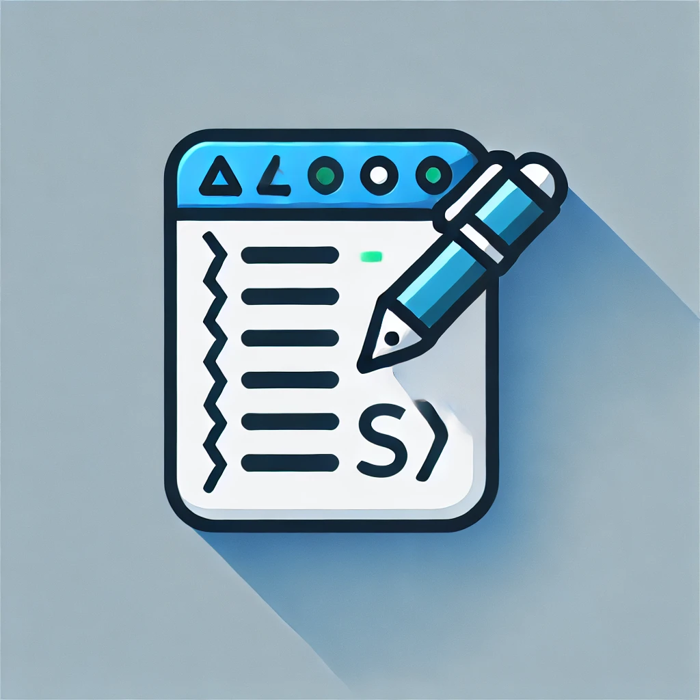

# AllCommit



AllCommit is a Visual Studio Code extension that automates the generation of commit descriptions, provides code reviews, and allows users to easily add comments to a file.

## Features

- **Auto Commit Descriptions**: Automatically generate professional Git commit descriptions.
- **Code Reviews**: Get a score and feedback on your code quality, readability, and adherence to best practices.
- **Add Comments**: Automatically add comments to your code.
- **Branch Management**: Easily switch between branches and push/pull changes.

## Requirements

- Visual Studio Code version 1.96.0 or higher.
- An OpenAI API key stored in a `.env` file with the variable `OPEN_AI`.

## Installation

1. Clone the repository.
2. Run `npm install` to install the dependencies.
3. Add your OpenAI API key to a `.env` file in the root of the project:
    ```
    OPEN_AI=your_openai_api_key
    ```

## Usage

### Commands

The extension provides the following commands:

- `AllCommit: Hello World`: Displays a welcome message.
- `AllCommit: Save Commit`: Saves commit information and generates a commit description.
- `AllCommit: Push`: Pushes changes to the selected branch.
- `AllCommit: Add Comments`: Adds comments to the active file.
- `AllCommit: Select Your Language`: Changes the language for commit descriptions.
- `AllCommit: Review Code`: Reviews the code in the active file and provides a score.
- `AllCommit: Pull`: Pulls changes from the selected branch.

### Running the Extension

1. Press `F5` to open a new window with your extension loaded.
2. Run your command from the command palette by pressing `Ctrl+Shift+P` (or `Cmd+Shift+P` on Mac) and typing the command name.

## Extension Settings

This extension does not add any VS Code settings through the `contributes.configuration` extension point.

## Known Issues

- maybe env openai key not properly imported to src

## Release Notes

### 0.0.1

- Initial release of AllCommit.

## Contributing

Contributions are welcome! Please open an issue or submit a pull request.

## License

This project is licensed under the MIT License.
